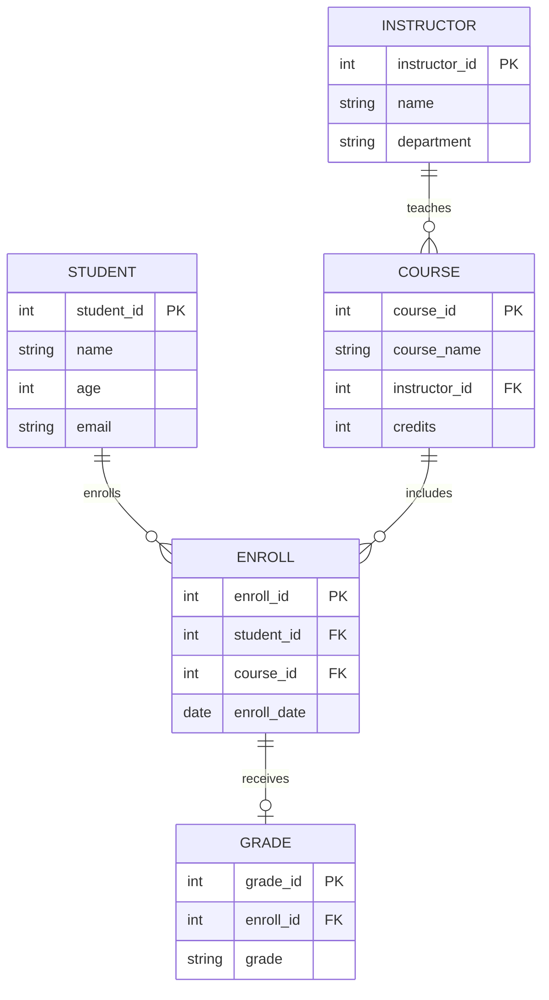

# 🎓 Student Enrollment Management System

A full-stack mini-project that turns a classic DBMS assignment into a working web application — a normalized SQLite database wrapped in a Streamlit CRUD interface for managing students, courses, instructors, enrollments, and grades.

**🚀 Live Demo:** https://student-enrollment-system-ta7w.onrender.com/
**📂 Source:** https://github.com/Parimal1004/MyProjects/edit/main/student_enrollment_system

---

## 1. Problem Statement

Managing student enrollments manually is time-consuming and prone to errors. It becomes difficult to track which students are enrolled in which courses and to retrieve information quickly. This project implements a database-backed system to store, organize, and manage student, course, and enrollment data efficiently, with a simple web UI on top for real interaction instead of raw SQL scripts.

## 2. Objectives

* Store student, course, and instructor details in a structured, normalized format
* Track student enrollments and grades
* Provide an interactive UI for adding, viewing, and deleting records
* Support queries for fast, reliable data retrieval
* Enforce data accuracy using primary keys, foreign keys, `CHECK`, and `UNIQUE` constraints

## 3. Tech Stack

| Layer    | Technology |
| -------- | ---------- |
| Database | SQLite     |
| Backend  | Python 3   |
| Frontend | Streamlit  |
| Data     | pandas     |

## 4. Entity-Relationship Diagram



## 5. Schema Highlights

* `STUDENT.age` is constrained with `CHECK (age > 0 AND age < 100)`
* `STUDENT.email` is `UNIQUE`
* `ENROLL` has a `UNIQUE (student_id, course_id)` constraint
* `GRADE.grade` is constrained to `A / B / C / D / F`
* All foreign keys are enforced using `PRAGMA foreign_keys = ON`

Full schema: [`schema.sql`](./schema.sql) · Seed data: [`seed.sql`](./seed.sql)

## 6. Features

* **Dashboard** — live counts and a course-wise enrollment chart
* **Students / Courses / Instructors** — add, view, and delete records
* **Enrollments** — enroll students in courses with duplicate enrollment prevention
* **Grades** — assign grades to enrollments
* **Reports** — JOIN, `NOT EXISTS`, `LEFT JOIN`, `GROUP BY`, and average grade queries

## 7. Run Locally

```bash
# 1. Clone the repo
git clone <your-repo-url>
cd student_enrollment_system

# 2. Install dependencies
pip install -r requirements.txt

# 3. Initialize the database
python init_db.py

# 4. Launch the app
streamlit run app.py
```

The app opens at `http://localhost:8501`.

## 8. Project Structure

```text
student_enrollment_system/
├── app.py              # Streamlit application
├── schema.sql          # Table definitions and constraints
├── seed.sql            # Sample data
├── init_db.py          # Database initialization
├── requirements.txt    # Python dependencies
├── .gitignore
└── README.md
```

## 9. Possible Extensions

* Add authentication for students and administrators
* Export reports to CSV/PDF
* Switch the backend to PostgreSQL
* Add a REST API using FastAPI
