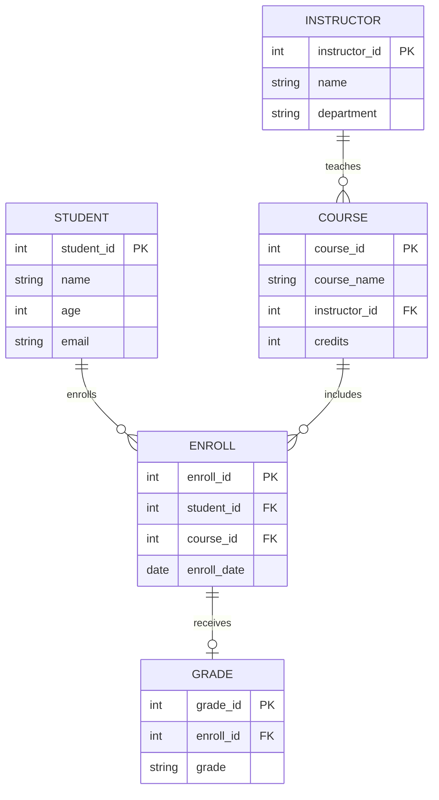

# 🎓 Student Enrollment Management System

A full-stack mini-project that turns a classic DBMS assignment into a working
web application — a normalized SQLite database wrapped in a Streamlit CRUD
interface for managing students, courses, instructors, enrollments, and grades.

**Live demo:** _add your deployed Streamlit Cloud link here_
**Source:** _add your GitHub repo link here_

---

## 1. Problem Statement

Managing student enrollments manually is time-consuming and prone to errors.
It becomes difficult to track which students are enrolled in which courses
and to retrieve information quickly. This project implements a database-backed
system to store, organize, and manage student, course, and enrollment data
efficiently, with a simple web UI on top for real interaction instead of raw
SQL scripts.

## 2. Objectives

- Store student, course, and instructor details in a structured, normalized format
- Track student enrollments and grades
- Provide an interactive UI for adding, viewing, and deleting records
- Support queries for fast, reliable data retrieval (e.g. unenrolled students, course-wise counts)
- Enforce data accuracy using primary keys, foreign keys, `CHECK`, and `UNIQUE` constraints

## 3. Tech Stack

| Layer     | Technology              |
|-----------|--------------------------|
| Database  | SQLite                  |
| Backend   | Python 3                |
| Frontend  | Streamlit               |
| Data      | pandas                  |

## 4. Entity-Relationship Diagram



*(GitHub renders this Mermaid diagram automatically when viewing the README.)*

## 5. Schema Highlights

- `STUDENT.age` is constrained with `CHECK (age > 0 AND age < 100)`
- `STUDENT.email` is `UNIQUE`
- `ENROLL` has a `UNIQUE (student_id, course_id)` constraint — a student can't enroll in the same course twice
- `GRADE.grade` is constrained to `A / B / C / D / F` via `CHECK`
- All foreign keys are enforced (`PRAGMA foreign_keys = ON`)

Full schema: [`schema.sql`](./schema.sql) · Seed data: [`seed.sql`](./seed.sql)

## 6. Features

- **Dashboard** — live counts and a course-wise enrollment chart
- **Students / Courses / Instructors** — add, view, delete records
- **Enrollments** — enroll a student in a course (duplicate enrollment blocked at the DB level)
- **Grades** — assign grades to enrollments, only for enrollments not yet graded
- **Reports** — the original assignment queries, now live:
  - Students enrolled in courses (JOIN)
  - Students not enrolled in any course (`NOT EXISTS`)
  - Course-wise student count (`LEFT JOIN` + `GROUP BY`)
  - Average grade points per course

## 7. Run Locally

```bash
# 1. Clone the repo
git clone <your-repo-url>
cd student_enrollment_system

# 2. Install dependencies
pip install -r requirements.txt

# 3. Initialize the database (creates enrollment.db from schema.sql + seed.sql)
python init_db.py

# 4. Launch the app
streamlit run app.py
```

The app opens at `http://localhost:8501`.

## 8. Deploy for Free (Streamlit Community Cloud)

1. Push this folder to a public GitHub repository.
2. Go to [share.streamlit.io](https://share.streamlit.io) and sign in with GitHub.
3. Click **New app**, select your repo, branch, and set the main file to `app.py`.
4. Under **Advanced settings**, add a **Deploy hook / build command** — or simply add
   this line at the very top of `app.py` (already handled by `init_db.py`) so the
   database is created automatically the first time the app runs:
   ```python
   import os, subprocess
   if not os.path.exists("enrollment.db"):
       subprocess.run(["python", "init_db.py"])
   ```
5. Click **Deploy**. You'll get a public URL like
   `https://your-app-name.streamlit.app` — put this on your resume and LinkedIn.

## 9. Project Structure

```
student_enrollment_system/
├── app.py            # Streamlit application (all pages)
├── schema.sql         # Table definitions + constraints
├── seed.sql            # Sample data
├── init_db.py          # Builds enrollment.db from schema + seed
├── requirements.txt   # Python dependencies
├── .gitignore
└── README.md
```

## 10. Possible Extensions

- Add authentication (student vs admin login)
- Export reports to CSV/PDF
- Switch backend to PostgreSQL for a "production-grade" version
- Add a REST API layer (FastAPI) in front of the database
